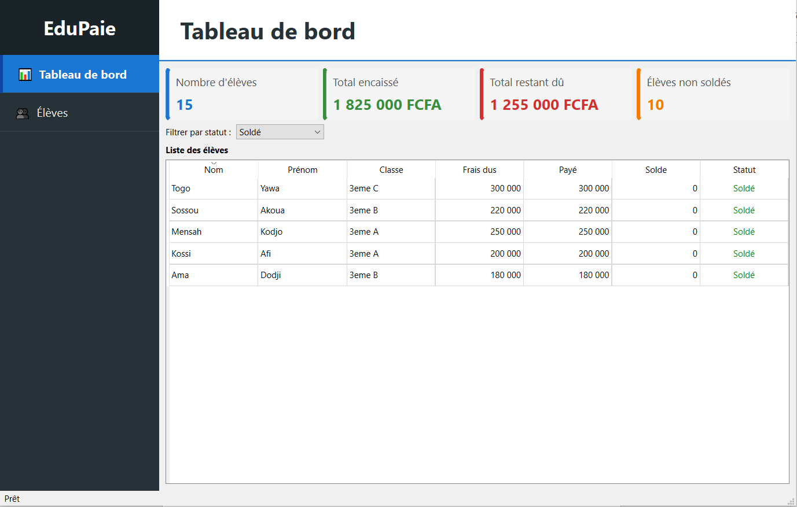
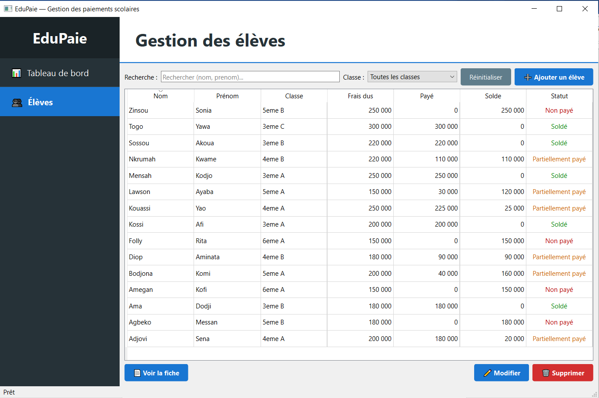
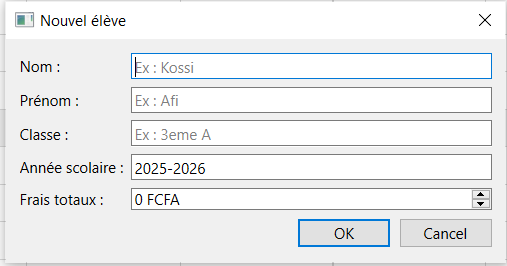
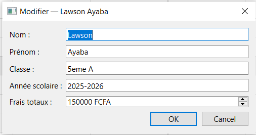
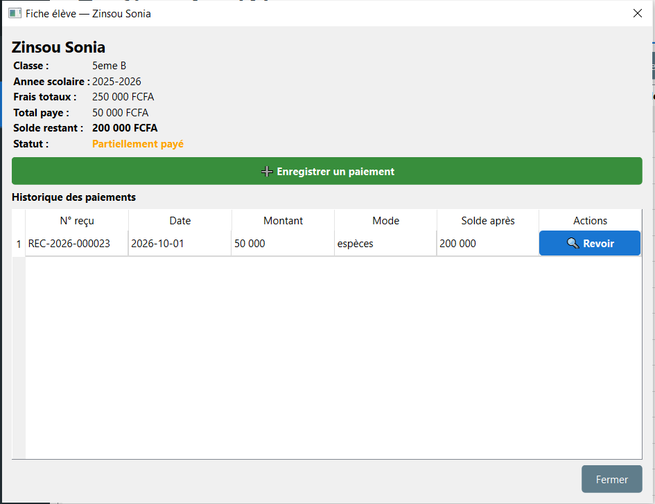
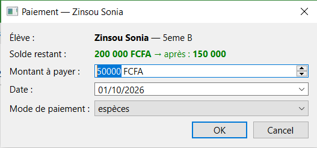
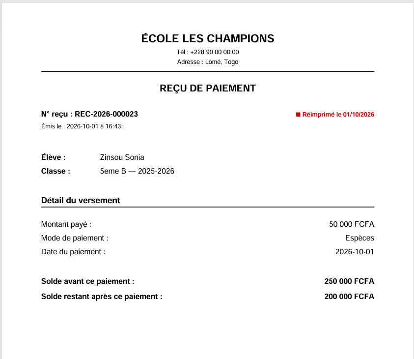

# Documentation technique — EduPaie

**Application desktop de gestion des paiements scolaires**

**Auteur** : Isidore Komlan Djidjignan  
**Date** :  29/09 - 02/10/2026  
**Dépôt** : https://github.com/isdordjidjigna-lgtm/EduPaie

---

## 1. Présentation du projet

EduPaie est une application desktop destinée à un établissement scolaire pour centraliser l'enregistrement des élèves et le suivi de leurs paiements. Elle remplace le suivi manuel réalisé dans des cahiers ou des fichiers Excel.

L'application permet d'enregistrer les élèves, de gérer leurs inscriptions par année scolaire, d'enregistrer les versements, de calculer automatiquement le solde restant, de déterminer le statut de paiement et de générer un reçu numéroté pouvant être consulté et réimprimé.

---

## 2. Objectifs

- Centraliser les informations relatives aux élèves et à leurs frais scolaires.
- Éviter les erreurs de calcul du solde restant dû.
- Conserver un historique fiable de chaque paiement.
- Associer chaque paiement à un reçu possédant un numéro unique.
- Permettre une consultation rapide des élèves selon leur situation de paiement.
- Fournir une application simple utilisable par une secrétaire ou un agent de caisse sans connaissances techniques.

---

## 3. Fonctionnalités principales

| Fonctionnalité | Description |
|----------------|-------------|
| **Gestion des élèves** | Ajouter, modifier, supprimer, rechercher et filtrer par classe. |
| **Gestion des inscriptions** | Associer un élève à une année scolaire, une classe et un montant total dû. |
| **Paiements** | Enregistrer le montant, la date et le mode de paiement. |
| **Calcul du solde** | Calculer automatiquement le total payé et le solde restant. |
| **Statut** | Déterminer automatiquement : Non payé, Partiellement payé ou Soldé. |
| **Historique** | Consulter chronologiquement les paiements et les reçus associés. |
| **Reçus** | Générer un reçu numéroté, exportable en PDF et réimprimable à l'identique. |
| **Tableau de bord** | Afficher le nombre d'élèves, les montants encaissés, les restes dus et les élèves non soldés. |

---

## 4. Architecture retenue

L'application suit une **architecture en 3 couches** :

| Couche | Dossier | Rôle |
|--------|---------|------|
| **Interface** | `ui/` | Fenêtres, formulaires, tableaux, boutons, signaux/slots PySide6. |
| **Métier** | `services/` | Validation, calcul du solde, statut, numérotation, génération PDF. |
| **Données** | `repositories/` | Encapsulation SQL, communication avec SQLite. |
| **Base** | `database/` | Connexion SQLite, schéma SQL, seed. |

**Flux principal** : `UI → Services → Repositories → SQLite`

**Règle d'or** : aucun widget PySide6 ne contient de requête SQL.

---

## 5. Modélisation des données

Le modèle repose sur **3 tables** : `ELEVE`, `PAIEMENT` et `RECU`.

| Table | Principales données | Rôle |
|-------|---------------------|------|
| **ELEVE** | `id`, `nom`, `prenom`, `classe`, `annee_scolaire`, `montant_total`, `date_creation` | Identité de l'élève et frais totaux. |
| **PAIEMENT** | `id`, `eleve_id`, `montant`, `date_paiement`, `mode_paiement` | Chaque versement rattaché à un élève. |
| **RECU** | `id`, `numero`, `paiement_id`, `date_emission`, `solde_avant`, `solde_apres`, `eleve_*_snapshot`, `nb_impressions` | Document légal généré pour chaque paiement. |

### Relations

- Un élève a **0 à N paiements** ; chaque paiement appartient à **1 seul élève**.
- Chaque paiement génère **exactement 1 reçu** ; chaque reçu correspond à **1 seul paiement**.

### Choix de conception

- **Le reçu est une entité séparée** : il possède son propre numéro unique, sa date d'émission et un compteur d'impressions.
- **Snapshots dans le reçu** : les colonnes `eleve_nom_snapshot`, `eleve_prenom_snapshot`, `eleve_classe_snapshot` et `eleve_annee_snapshot` contiennent une copie figée des informations de l'élève au moment de l'émission. Cela garantit la **réimpression à l'identique** même si l'élève change de classe.
- **`solde_avant` et `solde_apres`** sont figés au moment de l'émission pour faciliter l'audit et la traçabilité.

### Contraintes d'intégrité

- `PRIMARY KEY` sur chaque table.
- `FOREIGN KEY (paiement.eleve_id) → eleve.id` avec `ON DELETE CASCADE`.
- `FOREIGN KEY (recu.paiement_id) → paiement.id` avec `ON DELETE CASCADE`.
- `UNIQUE(paiement_id)` sur `recu` → un seul reçu par paiement.
- `UNIQUE(numero)` sur `recu`.
- `CHECK(montant > 0)` sur `paiement`.
- `CHECK(montant_total >= 0)` sur `eleve`.
- `CHECK(mode_paiement IN ('espèces','chèque','virement','mobile_money'))`.

Le script SQL complet est dans `database/schema.sql`.

---

## 6. Règles métier et sécurité des données

- **Solde** = `eleve.montant_total` − `SUM(paiement.montant)` pour un élève donné.
- Un paiement doit avoir un **montant strictement positif**.
- Un paiement **supérieur au solde restant est refusé** avec un message explicite.
- **Statut dérivé** :
  - `solde = 0` → **Soldé**
  - `0 < solde < montant_total` → **Partiellement payé**
  - `solde = montant_total` → **Non payé**
- Chaque paiement possède un **numéro de reçu unique** (format `REC-AAAA-NNNNNN`).
- Les **champs obligatoires** sont validés avant enregistrement.
- Les **erreurs** sont interceptées et présentées via `QMessageBox` ; un **filet de sécurité global** (`sys.excepthook`) empêche tout arrêt brutal.

---

## 7. Choix techniques

| Technologie | Justification |
|-------------|---------------|
| **Python 3.10+** | Langage principal, adapté au développement desktop. |
| **PySide6** | Framework graphique officiel Qt pour Python. |
| **SQLite via `sqlite3`** | Base légère, sans serveur, idéale pour une application locale. |
| **Pas d'ORM** | SQL maîtrisé et explicite, conforme au brief. |
| **ReportLab** | Génération PDF des reçus avec contrôle total du rendu. |
| **PyInstaller** | Packaging en `.exe` autonome. |
| **Inno Setup** | Installeur Windows professionnel. |
| **Git** | Versionnement avec historique de commits significatif. |

---

## 8. Captures d'écran

### Capture 1 — Tableau de bord



Le tableau de bord affiche les 4 indicateurs clés : nombre d'élèves, total encaissé, total restant dû et nombre d'élèves non soldés.

### Capture 2 — Liste et recherche des élèves



La vue Élèves propose une recherche par nom/prénom, un filtre par classe, et un tableau à 8 colonnes (ID, Nom, Prénom, Classe, Frais dus, Payé, Solde, Statut).

### Capture 3 — Formulaire d'ajout d'un élève



Le formulaire d'ajout permet de saisir les informations d'un nouvel élève : nom, prénom, classe, année scolaire et montant total dû.

### Capture 4 — Formulaire de modification d'un élève



Le formulaire de modification permet d'éditer les informations d'un élève existant.

### Capture 5 — Fiche élève avec solde et historique



La fiche élève affiche les informations personnelles, le solde restant, le statut et l'historique complet des paiements avec possibilité de revoir chaque reçu.

### Capture 6 — Dialogue d'enregistrement d'un paiement



Le dialogue permet de saisir le montant, la date et le mode de paiement (espèces, chèque, virement, mobile money).

### Capture 7 — Exemple de reçu PDF



Chaque paiement génère un reçu PDF numéroté contenant les informations de l'élève, le montant payé, le mode, le solde restant, ainsi qu'un numéro unique de type `REC-AAAA-NNNNNN`.

---

## 9. Jeu de données et tests

La base de démonstration (`edupaie.db`) contient **15 élèves** et **22 paiements** avec des situations variées : soldés, partiellement payés, non payés.

### Scénarios de test

| Scénario | Résultat attendu |
|----------|------------------|
| Ajouter un élève valide | Ajouté dans la liste |
| Ajouter un élève avec champs vides | Message d'erreur |
| Enregistrer un paiement valide | PDF généré, solde recalculé |
| Paiement > solde | Refus avec message |
| Paiement ≤ 0 | Refus avec message |
| Recherche par nom | Liste filtrée |
| Filtre par classe | Liste filtrée |
| Réimpression d'un reçu | PDF identique régénéré |

---

## 10. Limites connues

- Application **locale** : les données SQLite sont stockées sur la machine.
- **Pas de synchronisation** entre plusieurs postes.
- **Gestion des comptes utilisateurs** non implémentée.
- Modes de paiement limités aux 4 prévus par le brief.
- Les reçus dépendent du **lecteur PDF** installé.
- Application **mono-langue** (français).

---

## 11. Installation et distribution

### En développement

```bash
git clone https://github.com/isdordjidjigna-lgtm/EduPaie.git
cd EduPaie
python -m venv .venv
source .venv/Scripts/activate
pip install -r requirements.txt
python main.py