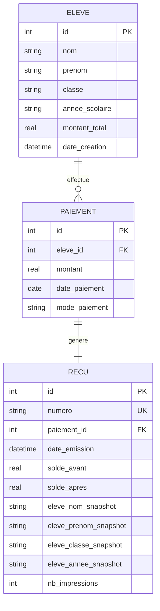
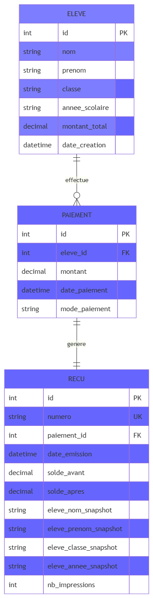

# Modèle Conceptuel de Données — EduPaie

## 1. MCD — Diagramme (Mermaid, interactif)



## 2. MCD — Version illustrée



## 3. MLD (Modèle Logique de Données)

```
ELEVE (id, nom, prenom, classe, annee_scolaire, montant_total, date_creation)

PAIEMENT (id, #eleve_id, montant, date_paiement, mode_paiement)

RECU (id, numero, #paiement_id, date_emission, solde_avant, solde_apres,
      eleve_nom_snapshot, eleve_prenom_snapshot, eleve_classe_snapshot,
      eleve_annee_snapshot, nb_impressions)
```

## 4. Cardinalités

| Relation | Cardinalité | Signification |
|---|---|---|
| ELEVE — PAIEMENT | **1..n** | Un élève a 0 à plusieurs paiements |
| PAIEMENT — RECU | **1..1** | Un paiement a exactement 1 reçu |

## 5. Justifications

### Pourquoi 3 entités ?

- **ELEVE** : identité stable de l'élève et frais totaux
- **PAIEMENT** : chaque versement individuel
- **RECU** : document légal avec numéro unique et snapshots

Le reçu est une **entité à part entière** : il a sa propre date d'émission,
son propre numéro, son propre état (`nb_impressions`). Il ne peut pas être
fusionné avec `paiement`.

### Pourquoi des snapshots dans RECU ?

Les colonnes `eleve_*_snapshot` contiennent une **copie figée** des
informations de l'élève **au moment de l'émission**.

**Pourquoi ?** Un élève peut changer de classe ou d'année scolaire.
Sans snapshots, un reçu réimprimé afficherait les **nouvelles** informations
→ violation du principe de **ré-impression à l'identique**.

### Pourquoi `solde_avant` et `solde_apres` ?

Ces valeurs sont **figées** au moment de l'émission. Elles permettent :
- De tracer la progression du paiement d'un élève
- D'auditer un reçu sans recalculer tous les paiements précédents

## 6. Contraintes d'intégrité

| Contrainte | Table | But |
|---|---|---|
| `PRIMARY KEY` | Toutes | Identifiant unique |
| `FOREIGN KEY` | paiement, recu | Intégrité référentielle |
| `UNIQUE(numero)` | recu | Numéros uniques |
| `UNIQUE(paiement_id)` | recu | Un seul reçu par paiement |
| `CHECK(montant > 0)` | paiement | Montants positifs |
| `CHECK(mode_paiement IN (...))` | paiement | Modes valides |
| `CHECK(montant_total >= 0)` | eleve | Frais non négatifs |

## 7. Script SQL

Le script complet est dans [`database/schema.sql`](../database/schema.sql).

## 8. Jeu de données

15 élèves, 22 paiements — généré par [`database/seed.py`](../database/seed.py).